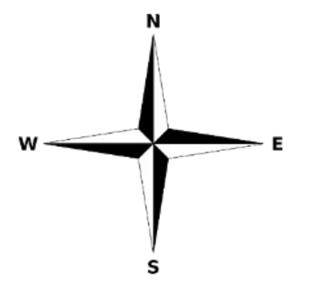
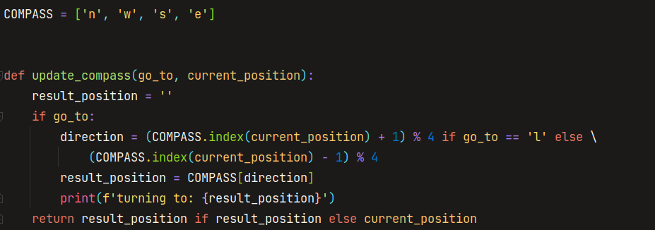
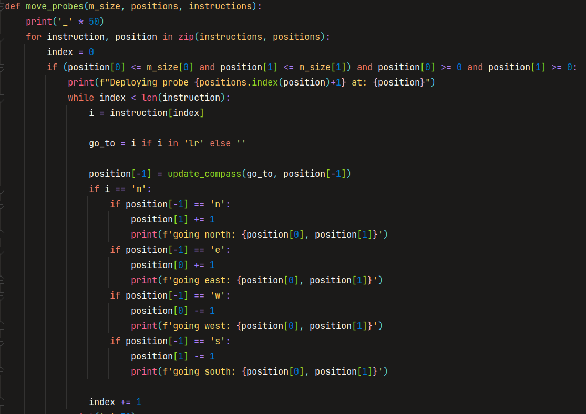
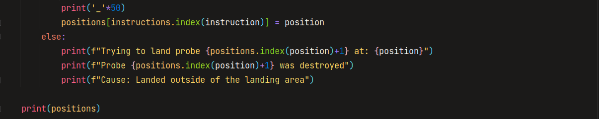
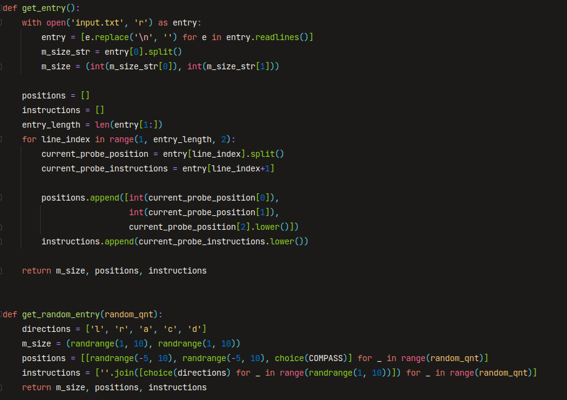

# exploring_mars
Um conjunto de sondas foi enviado pela NASA à Marte e irá pousar num planalto. Esse planalto, que curiosamente é retangular, deve ser explorado pelas sondas para que suas câmeras embutidas consigam ter uma visão completa da área e enviar as imagens de volta para a Terra.

A posição e direção de uma sonda são representadas por uma combinação de
coordenadas x-y e uma letra representando a direção cardinal para qual a sonda
aponta, seguindo a rosa dos ventos em inglês.

O planalto é dividido numa malha para simplificar a navegação. Um exemplo de
posição seria (0, 0, N), que indica que a sonda está no canto inferior esquerdo e
apontando para o Norte.

Para controlar as sondas, a NASA envia uma simples sequência de letras. As letras
possíveis são "L", "R" e "M". Destas, "L" e "R" fazem a sonda virar 90 graus para a 
esquerda ou direita, respectivamente, sem mover a sonda. "M" faz com que a sonda
mova-se para a frente um ponto da malha, mantendo a mesma direção.
Nesta malha o ponto ao norte de (x,y) é sempre (x, y+1).

# Entrada

A primeira linha da entrada de dados é a coordenada do ponto superior-direito da
malha do planalto. Lembrando que a inferior esquerda sempre será (0,0).
O resto da entrada será informação das sondas que foram implantadas. Cada sonda é
representada por duas linhas. A primeira indica sua posição inicial e a segunda uma
série de instruções indicando para a sonda como ela deverá explorar o planalto.
A posição é representada por dois inteiros e uma letra separados por espaços,
correspondendo à coordenada X-Y e à direção da sonda. Cada sonda será controlada
sequencialmente, o que quer dizer que a segunda sonda só irá se movimentar após
que a primeira tenha terminado suas instruções.

# Saída

A saída deverá contar uma linha para cada sonda, na mesma ordem de entrada,
indicando sua coordenada final e direção.

# Código

O código desenvolvido para a resolução deste problema é simples; 
Levei em consideração o valor passado na primeira linha apenas para testes. Não foi necessário criar uma
matriz devido a solução poder ser feita utilizando módulo.

A função acima é a função de se atualizar a bússola. Como pode ser observado, é utilizada a instrução que está sendo 
passada a sonda ao lado da posição atual para nos localizarmos dentro do mapa.
Visto que as instruções viram ela em 90 graus, somamos +1 no caso de ser necessário virá-la para a esqueda e diminuimos -1
caso seja necessário virá-la para a direita.
Para respeitar o range da variável COMPASS, o módulo é aplicado.

Já a função abaixo descreve o funcionamento do mecanismo de movimento da sonda
Onde fazemos a verificação se a posição inicial da sona está dentro dos limites impostos na primeira linha da entrada
 e então prosseguimos para primeiro atualizar a bússola e logo após isso mover a sonda caso seja detectada a instrução 'm'

Ao fim, é printada a saída de como as sondas se posicionaram dentro da área de pouso.

Por último, temos as funções de entrada. 

A primeira função captura a entrada que é passada por um arquivo.
Já a segunda cria valores aleatórios criados para testar o algoritmo.

# Instruções para rodar: 
1. Abra o terminal
2. Execute: 
   1. python exploring_mars.py 5 [Para o teste aleatório]
   2. python exploring_mars.py [Para rodar com a entrada passada por arquivo]
      1. Se quiser editar a entrada, basta editar o arquivo ExploringMars/input.txt 
